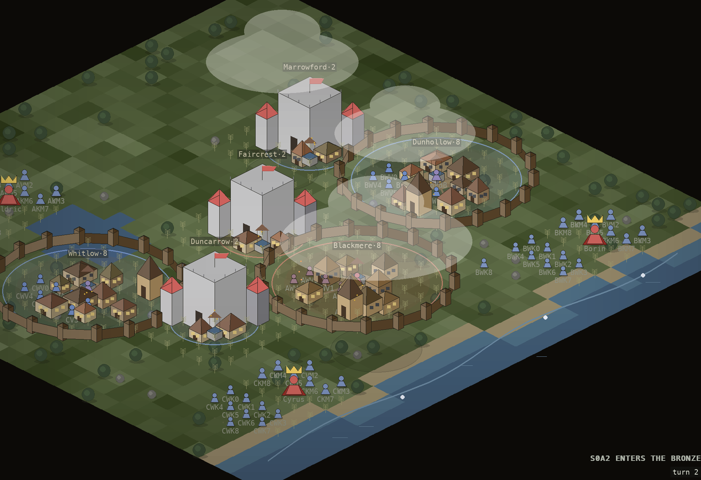
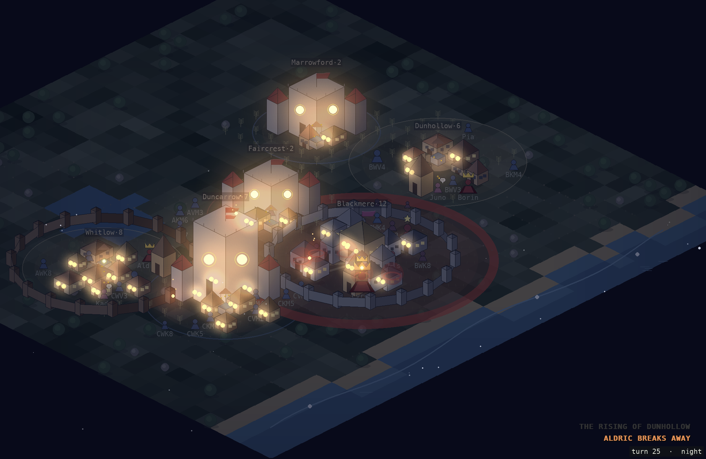
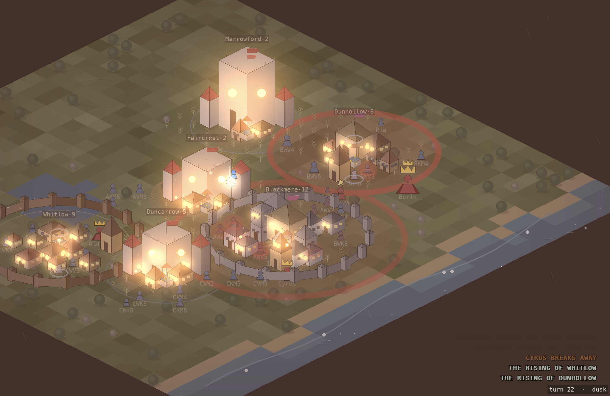
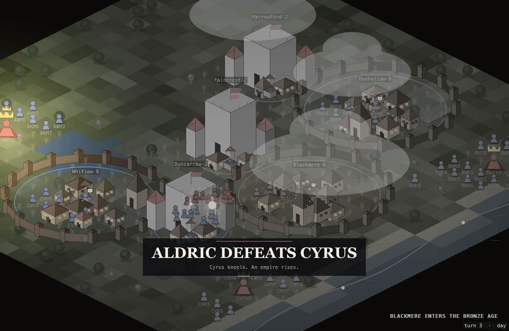

<div align="center">

# AI Civilization: A World That Writes Its Own History

**A simulation where every social layer emerges from the one below it.**


</div>

Agents forage, farm, teach, trade, have children, and accumulate wealth.
Nothing above that is scripted. Surplus creates inequality; inequality creates
lords; lords extract tribute; tribute creates resentment; resentment becomes
revolt. Along the way settlements invent writing, cross into the Bronze and Iron
Ages, crown kings, build empires, and depose them.

When the run ends, the world writes its own history.

---

## Watch it

[](https://youtu.be/9ZvSeNe0IGw?si=eB_DOLTITcQ035z_)

*45 turns, ~3 minutes. Seed 7.*

---

## What emerges

| Layer | Emerges from |
|---|---|
| Farming | foraging + surplus |
| Class | accumulated wealth |
| Lords | inequality |
| Kings | tribute + force |
| Empire | conquest |
| Revolt | tribute + hunger |
| Writing | literacy threshold |

Each layer is verified with controlled experiments. The emergence chain is a
claim the test suite checks, not merely a description.

---

## The chronicle

The world writes its own history. Read the full chronicle in
[HISTORY.md](HISTORY.md).

> *It opened with a surplus of grain and it ended with a surplus of grief, and
> the road between the two ran straight: the surplus made lords, and the lords
> made tribute, and the tribute made rage, and the rage made revolt. What the
> risings will make in their turn, another hand must set down.*

---

## Screenshots

### A capital at dusk



### Pressure building before a rising



### A crown lying vacant



---

## Where the LLM sits

This is a rule-based simulation with a local LLM consulted at **pivots**:
close calls where the outcome could go either way. It is **not** an
LLM-driven agent swarm.

- 2,391 agent-turns per run
- ~22 model calls (strategy caching + pivot-only consultation)
- Fully deterministic: same seed, same run, same footage

**The model's choices change history.**

The simulation remains deterministic because every model response is cached and
replayed for identical seeds.

Same seed, minds off vs. minds on:

| | Minds off | Minds on |
|---|---|---|
| First war | year 4 | year 39 |
| Outcome | empire, secession, risings | no cascade |
| Borin dies | *the Grasping*, deposed | *the Conqueror*, unbroken |

One close-margin decision, opposite fates.

See [HISTORY_minds.md](HISTORY_minds.md).

---

## Architecture

```
Resources
        │
        ▼
Agents ─────────► Surplus
                     │
                     ▼
                 Wealth
                     │
                     ▼
                Inequality
                     │
                     ▼
                  Lords
                     │
                     ▼
                 Tribute
                     │
          ┌──────────┴─────────┐
          ▼                    ▼
       Armies             Hunger
          │                    │
          ▼                    ▼
       Conquest            Revolt
          │
          ▼
       Empire
```

Nothing above the resource layer is scripted.
Every higher-level institution emerges from lower-level interactions.

---

## Running it

Clone the repository:

```bash
git clone https://github.com/prateekraj91/AI-Civilization.git
cd "AI Civilisation"
python3 -m venv .venv && source .venv/bin/activate
pip install -r requirements.txt
```

Run the exact showcase shown in the demo:

```bash
python3 main.py --showcase --seed 7
```

Run with the LLM enabled at pivots (requires Ollama + `qwen3:8b`):

```bash
python3 main.py --showcase --minds --seed 7
```

Generate a history book:

```bash
python3 main.py --showcase --chronicle --chronicle-out HISTORY.md --seed 7
```

---

## Testing

The simulation is heavily regression tested.

```bash
pytest
```

321 tests verify the emergence chain, deterministic replay, economy,
inheritance, warfare, revolt, history generation, and serialization.

Same seed.
Same history.
Same outcome.

---

## Known limitations

- Population is not sustainable past ~45 turns; showcase runs end while the
  world is alive.
- The war gate can launch with an empty host, producing no-op wars in the log
  (demoted from the visual director, invisible in footage).

---

## License

MIT